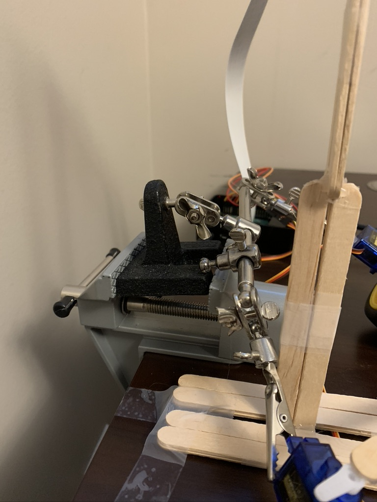
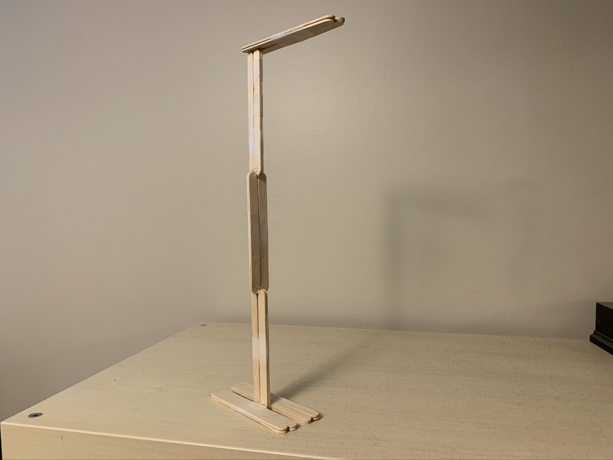
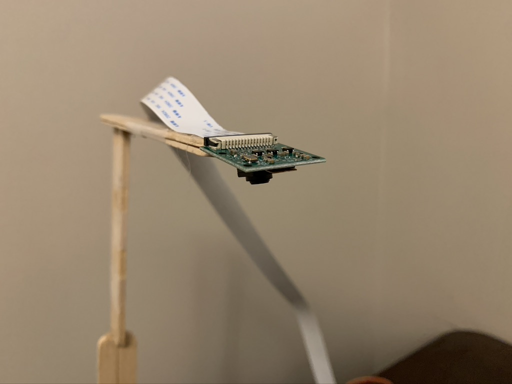
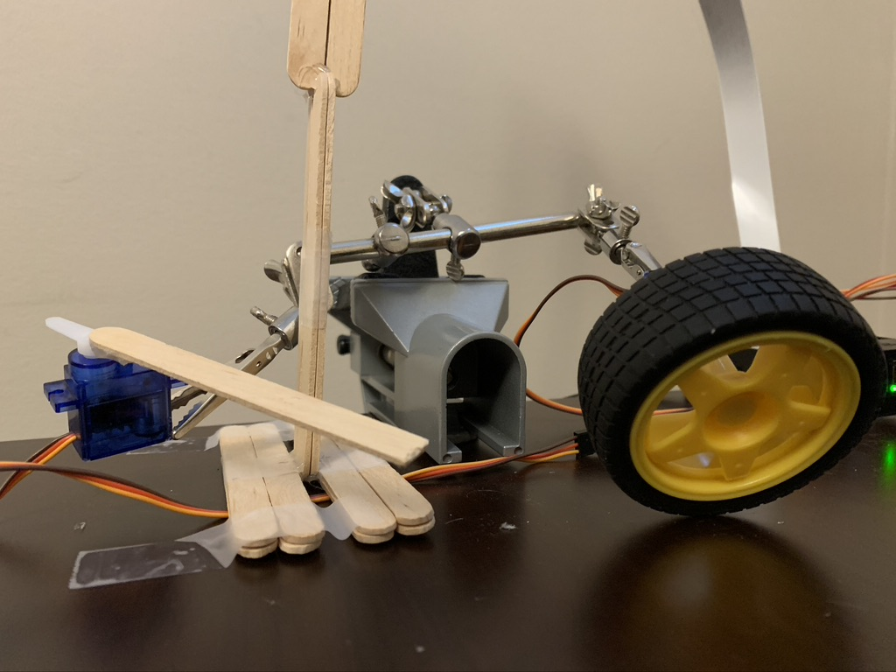
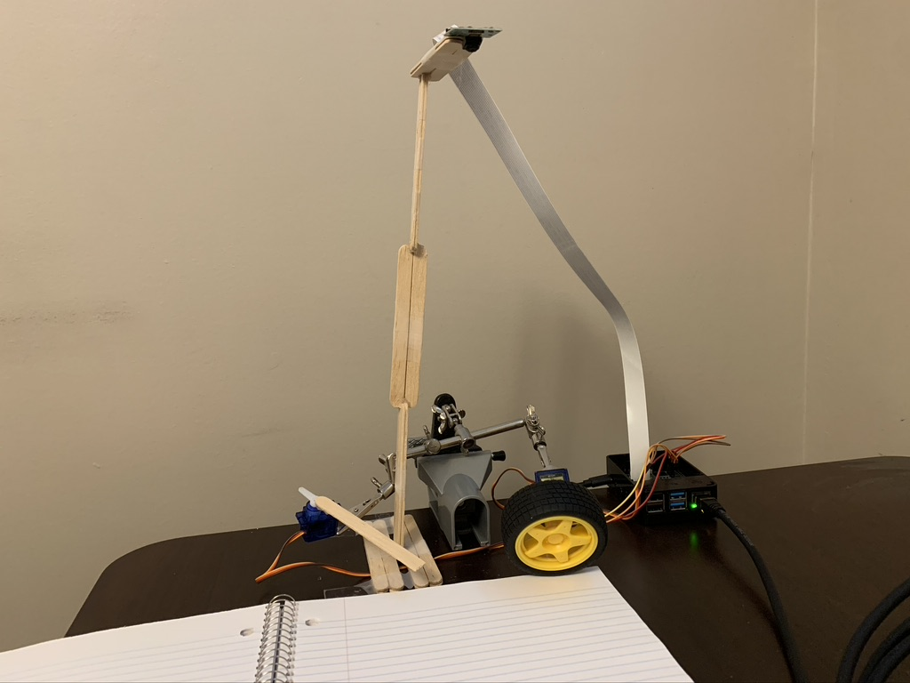

# Automated-Book-Scanner
Video

The idea behind this project just came up spontaneously when I had to scan a bunch of documents for online school. It seemed very inefficient to wait and manually flip pages. So I thought about how I could create a system that would flip through pages of a book and automatically scan it. I thought of some ideas of how I could flip the pages like programming a robotic arm with some sort of suction mechanism to flip the pages. But I found that I could flip the pages with a wheel which would be the simplest design and have a rod to turn the pages while a camera module would scan them, all using servos and a Raspberry Pi 3. I wanted the system to be automated so I wrote some code in Python that takes pictures of the pages as they were being flipped and saving them so the images could be used after. 

Research

I did some research into the market of book scanners to see how it is commercially done. A lot of it is still done by putting a book in a printer scanner and then flipping the page once a scan is done. However, the two main types of scanning methods are destructive and non destructive. For destructive methods the book’s pages are usually unbinded from the spine and then put into an automatic document feeder. The preferable method using non destructive ways has been done by some corporations where the primary method has been using air suction alongside angles and gravity to flip pages. Many of these methods use advanced imaging and sensing technologies to have high precision. For this project I wanted to have a more simple and inexpensive build. 

Build

The first thing I did was set up the two SG90 servos to the Raspberry Pi 3 using GPIO pin connections with male-to-female jumper wires shown below. Note if you can use a motor it is preferable because it has a 360 degree rotation and a servo only has 180 degree which is why in the video the wheel and servos go back to their original position. I then attached a wheel to the servo using hot glue and then part of a popsicle stick to another servo.

 

I used a soldering helping hand stand which I already had to hold up the device which allows for it to be used for various heights. Also I used my bench vise with swivel base to hold up the stand as the servos are pretty powerful and they need to be held securely. With the right amount of friction the wheel can lift up the page when it is turning in the correct direction. I found that putting the wheel in the top right corner of a page works well to lift the page up so the rod from the second servo can flip the page. I also created a stand for the Camera Module V2 to take pictures of the pages before they are flipped and saved, an example is shown below. To create the code I'm using python running on the raspberry pi and it's explained in the python file.

   
   
